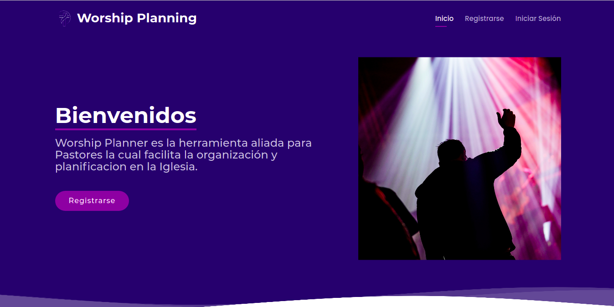
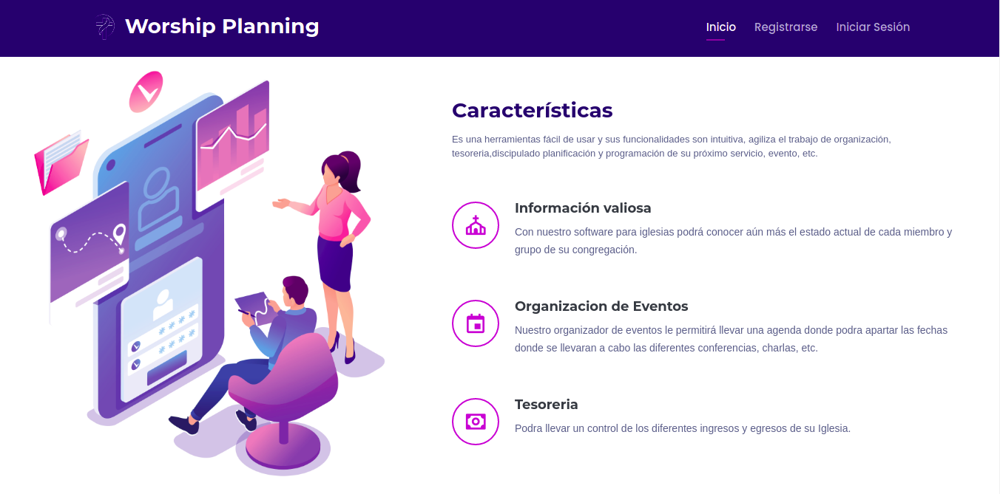
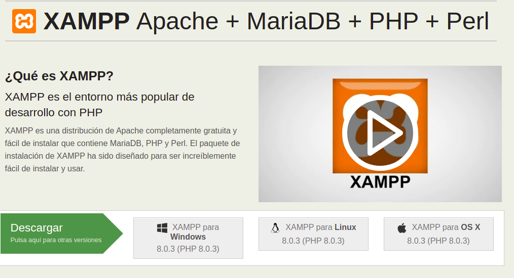
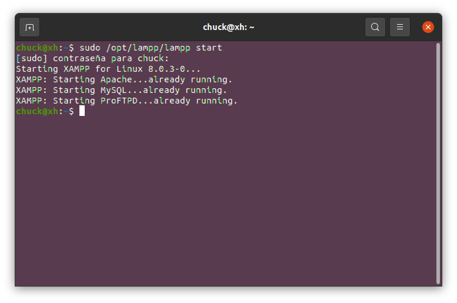
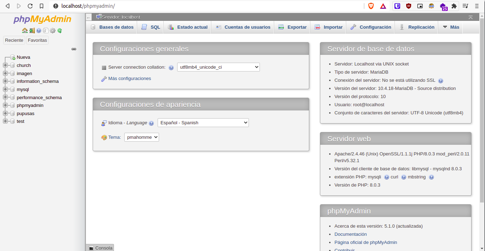
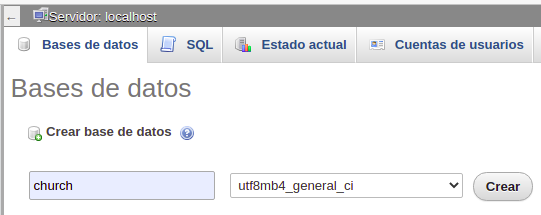
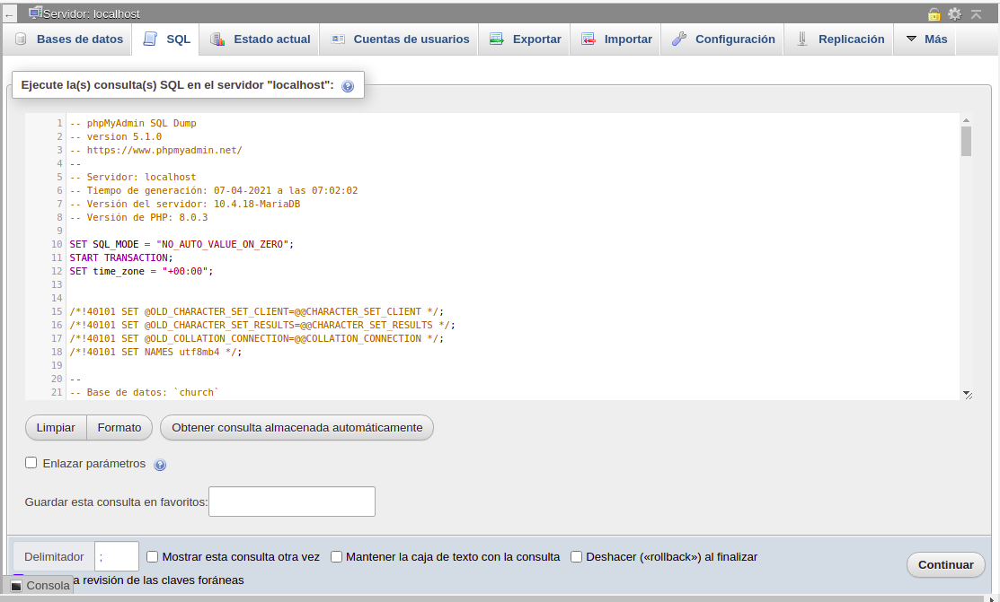
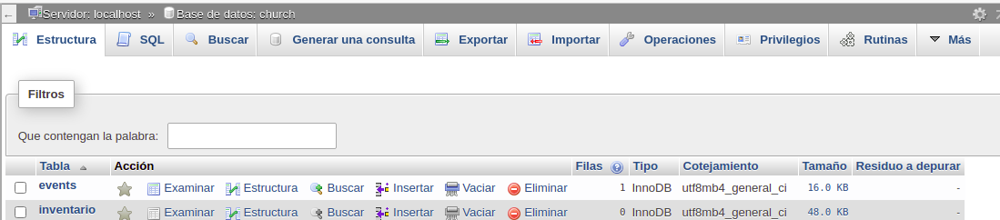
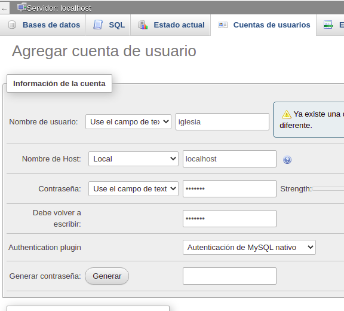
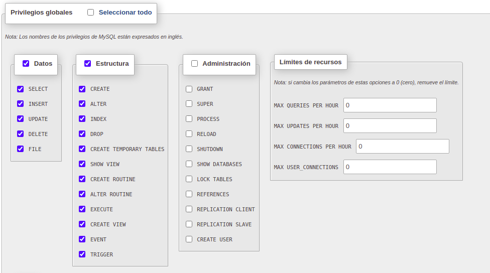

# Worship Planning

## Worship Planning es la herramienta aliada para Pastores la cual facilita la organización y planificación en la Iglesia.

## Instalación

Los siguientes pasos describen como llevar acabo una instalación de manera totalmente local:

1. Para poder ejecutar el sistema de manera local requerimos de XAMPP por lo que necesitamos descargarlo y llevar a cabo su instalación. para eso nos dirigimos a https://www.apachefriends.org/es/index.html

   

   El proceso de instalación de XAMPP es bastante rápido y sencillo.

2. Luego de instalado XAMPP tenemos que iniciar los servicios, en el caso de Windows buscamos el panel de control de XAMPP y damos clic en el boton de iniciar todos los servicios, en el caso de Linux ejecutamos el comando:

   > sudo /opt/lampp/lampp start

3. Luego accedemos al servidor local colocando en la barra de direcciones del navegador lo siguiente:

   > http://localhost/phpmyadmin/

4. Creamos una nueva base de datos con el nombre "church"

   

5. En los archivos del proyecto se encuentra el script para generar todas las tablas, seguimos esta ruta para encontrar el script

   > [Worship-Planning](https://github.com/Chucklagos/Worship-Planning)/[src](https://github.com/Chucklagos/Worship-Planning/tree/main/src)/**db**/church.sql

6. Nos movemos a la pestaña SQL en phpMyAdmin en donde ejecutaremos el script, copiamos y pegamos todo el contenido del script y ejecutamos con el botón continuar:

    

7. Seleccionamos la base de datos y nos movemos a la pestaña privilegios, esta se encuentra ubicada a la izquierda en la barra de menu, luego eso haremos clic en el boton "agregar cuenta de usuario":

   

8. Vamos a crear un usuario con:

   - nombre: iglesia

   - contraseña: iglesia

   - servidor: localhost

     Así como se muestra en la imagen 

9. Bajamos un poco y activamos los siguientes privilegios globales:

   

   Bajamos un poco mas y le damos al botón "Continuar", así ya tendremos nuestro usuario de la base de datos creado.

10. El proyecto debe colocarse en la carpeta "htdocs" que xampp crea en la instalación, simplemente descomprimimos o clonamos el proyecto dentro de esa carpeta. para acceder desde el navegador colocamos la siguiente direccion en la barra de direcciones del navegador:

    > http://localhost/Worship-Planning/

Y con eso el sistema ya se ejecuta de manera local, es importante que los servicios de xampp estén ejecutándose cuando deseamos acceder al sistema en localhost.